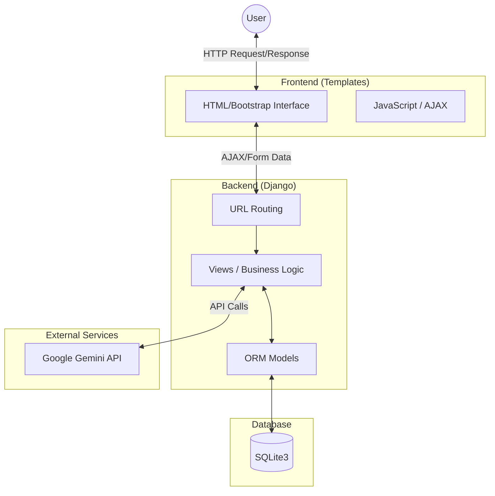
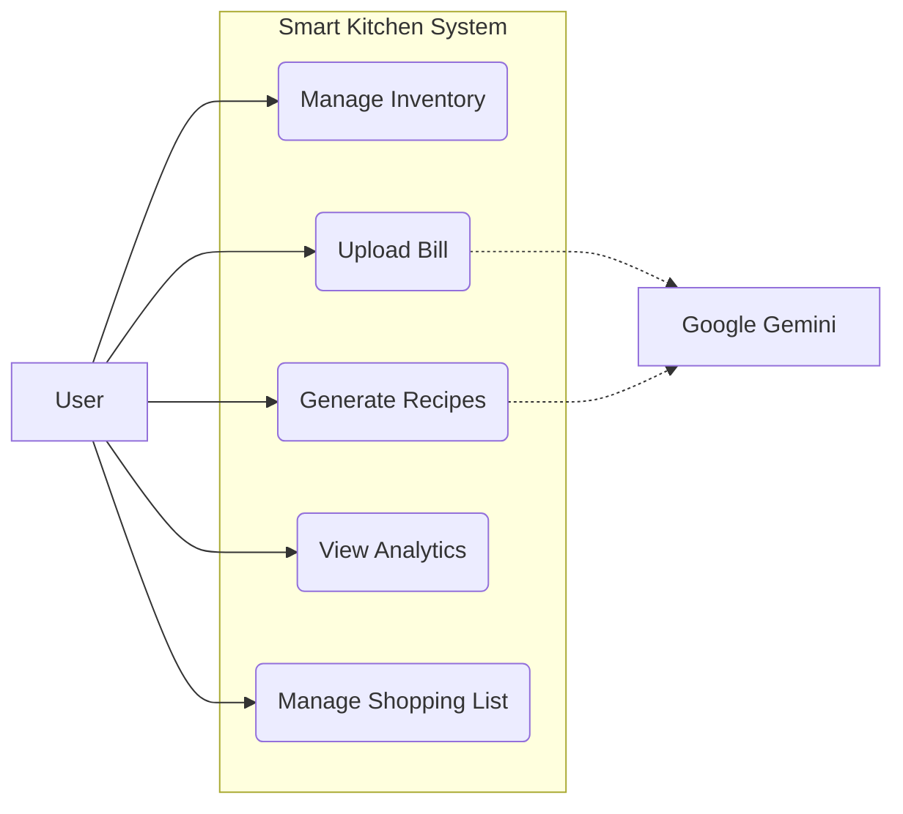
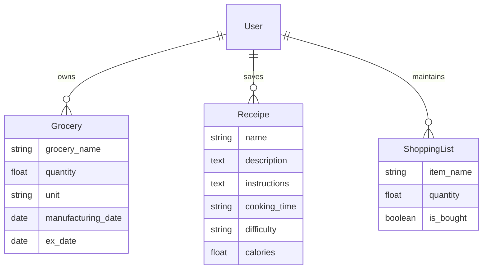
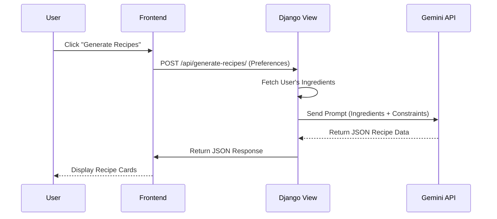

# Smart Kitchen Inventory System - Design & Architecture

## 1. System Architecture

The project follows the standard **Django Model-View-Template (MVT)** architecture, integrated with **Google Gemini AI** for intelligent features.

### Architecture Diagram

---

## 2. Module Details

### A. Authentication Module (`core`)
*   **Purpose**: Manages user access and security.
*   **Key Components**:
    *   `EmailBackend`: Custom authentication backend allowing login via email.
    *   `signin_view`, `signup_view`: Handle user sessions.
*   **Data Flow**: User Credentials -> Validation -> Session Creation.

### B. Inventory Module (`food`)
*   **Purpose**: Tracks grocery items, quantities, and expiry dates.
*   **Key Components**:
    *   `Grocery` Model: Stores item details (name, qty, unit, dates).
    *   `add_expiry_warnings`: Context processor that injects expiry alerts globally.
*   **Data Flow**: User Input -> Model Validation -> Database -> Dashboard Query.

### C. AI Chef Module (`food`)
*   **Purpose**: Generates recipes based on inventory.
*   **Key Components**:
    *   `generate_recipes_api`: Main logic engine. 
    *   Prompts: Custom engineered prompts to request JSON output from Gemini.
    *   `Receipe` Model: Caches generated recipes.
*   **Data Flow**: Inventory List -> Prompt Construction -> Gemini API -> JSON Parsing -> Frontend Display.

### D. Smart Scan Module (`food`)
*   **Purpose**: Digitizes physical data (bills, food photos).
*   **Key Components**:
    *   `upload_bill_view`: Handles file uploads.
    *   `save_bill_items`: Processes parsed bill data into inventory.
*   **Data Flow**: Image Upload -> Base64 Encoding -> Gemini Vision API -> Structured Data -> User Review -> Database.

---

## 3. Use Case Diagram

---

## 4. Database Schema (ER Diagram)

## 5. Sequence Diagram: Recipe Generation
To illustrate the interaction between the user, system, and AI:

