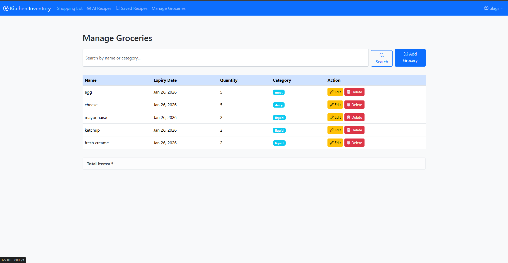

# 🍳 Smart Kitchen Inventory Management System

<div align="center">
  
  
  
  **Reduce food waste, save money, and discover recipes with AI-powered inventory management**
  
  [](https://djangoproject.com)
  [](https://python.org)
  [](https://ai.google.dev)

</div>

---

## 🌟 About This Project

A Django-based web application that transforms kitchen management through intelligent automation. Never let food go to waste again! This system tracks your groceries, alerts you about expiring items, and uses Google Gemini AI to suggest creative recipes based on what's in your fridge.

### 💡 The Problem It Solves

- 🗑️ **Food Waste**: Americans waste ~30-40% of food supply annually
- 💸 **Money Loss**: Average household loses $1,500/year on wasted food
- 🤔 **Recipe Fatigue**: "What should I cook with these random ingredients?"
- 📝 **Disorganized Shopping**: Buying duplicates or forgetting essentials

### ✨ The Solution

An intelligent kitchen assistant that:
- Tracks every item in your pantry with expiry monitoring
- Proactively alerts you about food going bad
- Generates personalized recipes using AI to save expiring ingredients
- Manages shopping lists automatically
- Keeps all your favorite recipes in one place

---

## 🚀 Core Features

### 📦 Smart Grocery Management

**Comprehensive Inventory Tracking**
- Add items with name, quantity, category, and expiry date
- Categorized organization (Dairy, Vegetables, Meat, Grains, etc.)
- Visual status indicators for quick scanning

**Intelligent Expiry Alerts**
- 🟡 **Expiring Soon**: Items within 7 days show a warning
- 🔴 **Expired**: Past-date items are flagged immediately
- 📊 **Priority Dashboard**: Auto-sorted by urgency

**Dashboard Overview**
```
┌─────────────────────────────────────┐
│  🔴 Expired (2 items)               │
│  🟡 Expiring Soon (5 items)         │
│  🟢 Fresh (23 items)                │
└─────────────────────────────────────┘
```

### 🤖 AI-Powered Recipe Generation

**Smart Ingredient Analysis**
- Automatically identifies ingredients expiring soon
- Sends context to Google Gemini 2.5 Flash API
- Generates 3 practical, waste-reducing recipes

**Contextual Recipe Creation**
```
Your Input: Milk (expires in 2 days), Bananas (3 days), Eggs (5 days)
       ↓
AI Analysis: "User has dairy and fruit expiring soon"
       ↓
Generated Recipes:
  1. Banana Pancakes with Milk
  2. French Toast Custard
  3. Smoothie Bowl with Banana & Yogurt
```

**Recipe Refinement**
- Ask AI to modify recipes in real-time
- Examples: "Make it spicy", "Vegetarian option", "Under 30 minutes"
- Iterative improvement until perfect

**Save & Organize**
- Store favorite AI recipes locally
- Build your personal cookbook
- Access offline anytime

### 🛒 Shopping List Management

**Smart Restocking**
- One-click add from inventory to shopping list
- Track quantities needed
- Mark items as purchased
- Automatic removal when restocked

**Planning Features**
- Add items not in inventory yet
- Organize by store sections
- Running grocery budget calculator

### 🔐 User Authentication & Privacy

**Secure Access**
- Industry-standard authentication
- Password encryption
- Session management

**Data Isolation**
- Each user has completely separate data
- Private inventory, recipes, and shopping lists
- No data sharing between accounts

---

## 🛠️ Technology Stack

```
Backend:        Django (Python) 🐍
Database:       SQLite (Development) 💾 | PostgreSQL (Production ready)
AI Engine:      Google Gemini 2.5 Flash API 🤖
Frontend:       Django Templates 📄 | HTML5 | CSS3 | Bootstrap 🎨
Authentication: Django Auth System 🔐
API:            Google Generative AI (generativelanguage.googleapis.com)
```

---

## 📂 Project Structure

```
kitchen-inventory-manager/
│
├── inventory/                    # Main App
│   ├── models.py                # Data Models
│   │   ├── Grocery             # Inventory items
│   │   ├── GroceryType         # Categories (Dairy, Veg, etc.)
│   │   ├── ShoppingList        # Shopping items
│   │   ├── Receipe             # Saved recipes
│   │   └── Receipe_Ingredients # Recipe components
│   │
│   ├── views.py                 # Application Logic
│   │   ├── index()             # Dashboard with expiry alerts
│   │   ├── add_grocery()       # Add inventory items
│   │   ├── suggest_recipes()   # AI recipe generation
│   │   ├── save_recipe()       # Store AI recipes
│   │   └── shopping_list()     # Manage shopping
│   │
│   ├── ai_service.py            # Google Gemini Integration
│   │   ├── generate_recipes()  # Send expiring items to AI
│   │   ├── refine_recipe()     # Modify based on user input
│   │   └── parse_response()    # Extract structured data
│   │
│   ├── templates/
│   │   ├── dashboard.html      # Main inventory view
│   │   ├── add_item.html       # Add grocery form
│   │   ├── recipes.html        # AI-generated recipes
│   │   ├── saved_recipes.html  # Personal cookbook
│   │   └── shopping_list.html  # Shopping interface
│   │
│   ├── static/
│   │   ├── css/
│   │   │   └── styles.css      # Custom styling
│   │   └── js/
│   │       └── inventory.js    # Interactive features
│   │
│   └── admin.py                 # Admin interface
│
├── users/                        # Authentication App
│   ├── views.py                 # Sign up/Sign in
│   ├── forms.py                 # User forms
│   └── templates/
│       ├── login.html
│       └── register.html
│
├── config/                       # Project Settings
│   ├── settings.py
│   ├── urls.py
│   └── wsgi.py
│
├── manage.py
├── requirements.txt
├── .env.example                  # Environment variables template
└── README.md
```

---

## 🚀 Quick Start

### Prerequisites

```bash
Python 3.8+
pip (Python package manager)
Google Gemini API Key (free tier available)
```

### Installation

1. **Clone the repository**
   ```bash
   git clone https://github.com/yourusername/kitchen-inventory-manager.git
   cd kitchen-inventory-manager
   ```

2. **Create virtual environment**
   ```bash
   python -m venv venv
   
   # Activate
   # Windows:
   venv\Scripts\activate
   # macOS/Linux:
   source venv/bin/activate
   ```

3. **Install dependencies**
   ```bash
   pip install -r requirements.txt
   ```

4. **Set up environment variables**
   ```bash
   # Create .env file
   cp .env.example .env
   
   # Add your Google Gemini API key
   GOOGLE_API_KEY=your_api_key_here
   ```

5. **Run database migrations**
   ```bash
   python manage.py makemigrations
   python manage.py migrate
   ```

6. **Create superuser (optional)**
   ```bash
   python manage.py createsuperuser
   ```

7. **Load sample grocery categories**
   ```bash
   python manage.py loaddata grocery_types.json
   ```

8. **Start development server**
   ```bash
   python manage.py runserver
   ```

9. **Access the application**
   - Main app: `http://127.0.0.1:8000/`
   - Admin panel: `http://127.0.0.1:8000/admin/`

---

## 📖 How It Works

### Complete User Workflow

```
┌─────────────────┐
│  1. Add Items   │  User stocks their kitchen inventory
└────────┬────────┘
         │
         ▼
┌─────────────────┐
│  2. Monitor     │  Dashboard shows expiry status
└────────┬────────┘         🟢 Fresh
         │                  🟡 Expiring Soon (7 days)
         │                  🔴 Expired
         ▼
┌─────────────────┐
│  3. Get Alert   │  System flags: "5 items expiring soon"
└────────┬────────┘
         │
         ▼
┌─────────────────┐
│  4. AI Recipes  │  Click "Suggest Recipes"
└────────┬────────┘         ↓
         │           Google Gemini generates 3 recipes
         │           using expiring ingredients
         ▼
┌─────────────────┐
│  5. Refine      │  "Make it vegetarian" → AI adjusts
└────────┬────────┘  "Add spice" → AI modifies
         │           "Quick version" → AI simplifies
         ▼
┌─────────────────┐
│  6. Save        │  Store recipe to personal cookbook
└────────┬────────┘
         │
         ▼
┌─────────────────┐
│  7. Restock     │  Move used items to shopping list
└─────────────────┘
```

### AI Recipe Generation Example

**User's Expiring Inventory:**
```python
expiring_items = [
    {"name": "Milk", "expires_in": "2 days", "quantity": "500ml"},
    {"name": "Eggs", "expires_in": "5 days", "quantity": "6"},
    {"name": "Spinach", "expires_in": "3 days", "quantity": "1 bunch"}
]
```

**AI Prompt Sent:**
```
Generate 3 practical recipes using these ingredients that are expiring soon:
- Milk (500ml) - expires in 2 days
- Eggs (6) - expires in 5 days  
- Spinach (1 bunch) - expires in 3 days

Focus on reducing food waste. Provide recipe name, ingredients, 
and step-by-step instructions.
```

**AI Response:**
```json
{
  "recipes": [
    {
      "name": "Spinach and Cheese Quiche",
      "prep_time": "45 minutes",
      "servings": 4,
      "ingredients": [
        "6 eggs",
        "250ml milk",
        "1 bunch spinach, chopped",
        "100g cheese",
        "1 pie crust"
      ],
      "instructions": [
        "Preheat oven to 375°F (190°C)",
        "Whisk eggs and milk together",
        "Sauté spinach until wilted",
        "..."
      ]
    },
    // ... 2 more recipes
  ]
}
```

---

## 🎯 Key Models

### Grocery Model
```python
class Grocery(models.Model):
    user = models.ForeignKey(User)           # Owner
    name = models.CharField(max_length=100)  # "Milk"
    quantity = models.CharField(max_length=50) # "500ml"
    grocery_type = models.ForeignKey(GroceryType) # "Dairy"
    expiry_date = models.DateField()         # 2026-01-26
    added_date = models.DateTimeField(auto_now_add=True)
    
    def expiry_status(self):
        days_until_expiry = (self.expiry_date - date.today()).days
        if days_until_expiry < 0:
            return 'expired'
        elif days_until_expiry <= 7:
            return 'expiring_soon'
        return 'fresh'
```

### Recipe Model
```python
class Receipe(models.Model):
    user = models.ForeignKey(User)
    name = models.CharField(max_length=200)
    instructions = models.TextField()
    prep_time = models.CharField(max_length=50)
    servings = models.IntegerField()
    created_at = models.DateTimeField(auto_now_add=True)
    
class Receipe_Ingredients(models.Model):
    recipe = models.ForeignKey(Receipe)
    ingredient = models.CharField(max_length=100)
    quantity = models.CharField(max_length=50)
```

### Shopping List Model
```python
class ShoppingList(models.Model):
    user = models.ForeignKey(User)
    item_name = models.CharField(max_length=100)
    quantity = models.CharField(max_length=50)
    grocery_type = models.ForeignKey(GroceryType)
    is_purchased = models.BooleanField(default=False)
    added_date = models.DateTimeField(auto_now_add=True)
```

---

## 🌟 Feature Highlights

### Smart Expiry Detection
```python
def get_expiring_items(user, days=7):
    """Get items expiring within specified days"""
    cutoff_date = date.today() + timedelta(days=days)
    return Grocery.objects.filter(
        user=user,
        expiry_date__lte=cutoff_date,
        expiry_date__gte=date.today()
    ).order_by('expiry_date')
```

### Recipe Refinement Flow
```python
# User asks: "Make it spicy"
refined_prompt = f"""
Previous recipe: {original_recipe}
User modification request: "Make it spicy"
Please adjust the recipe accordingly.
"""

# AI generates modified version
new_recipe = gemini_api.generate(refined_prompt)
```

---

## 🗺️ Roadmap

### ✅ Current Features
- [x] Inventory management with expiry tracking
- [x] AI-powered recipe generation
- [x] Shopping list functionality
- [x] User authentication and data privacy
- [x] Recipe saving and organization

### 🚧 In Development
- [ ] Mobile-responsive design improvements
- [ ] Barcode scanning for quick item entry
- [ ] Nutrition information for recipes
- [ ] Meal planning calendar

### 📋 Future Enhancements
- [ ] Mobile app (iOS/Android)
- [ ] Recipe sharing community
- [ ] Smart shopping list with price tracking
- [ ] Integration with grocery delivery services
- [ ] Dietary preference filters (vegan, gluten-free, etc.)
- [ ] Recipe rating and reviews
- [ ] Meal prep batch cooking suggestions
- [ ] Food waste statistics and insights
- [ ] OCR for receipt scanning
- [ ] Voice commands for hands-free cooking

---

## 🔧 Configuration

### Google Gemini API Setup

1. **Get API Key**
   - Visit [Google AI Studio](https://makersuite.google.com/app/apikey)
   - Create new API key (free tier available)
   - Copy the key

2. **Configure in .env**
   ```bash
   GOOGLE_API_KEY=your_api_key_here
   ```

3. **Customize AI Behavior** (in `ai_service.py`)
   ```python
   AI_CONFIG = {
       'model': 'gemini-2.5-flash',
       'temperature': 0.7,      # Creativity (0-1)
       'max_tokens': 1500,      # Response length
       'recipe_count': 3        # Recipes per request
   }
   ```

### Expiry Alert Settings

Edit in `settings.py`:
```python
EXPIRY_ALERT_DAYS = 7  # Days before expiry to show warning
CRITICAL_EXPIRY_DAYS = 2  # Days for critical alert
```

---

## 🐛 Troubleshooting

### AI Recipe Generation Fails

**Check API key:**
```bash
python manage.py shell
>>> import os
>>> print(os.getenv('GOOGLE_API_KEY'))
```

**Test API connection:**
```python
from inventory.ai_service import test_gemini_connection
test_gemini_connection()
```

### Expiry Dates Not Calculating

**Verify date format:**
```python
# Should be YYYY-MM-DD format
expiry_date = "2026-01-26"  # Correct
expiry_date = "26/01/2026"  # Wrong
```

### Shopping List Not Saving

**Check user authentication:**
- Ensure user is logged in
- Verify `request.user.is_authenticated`

---

## 🤝 Contributing

We welcome contributions! Here's how you can help:

- 🐛 Report bugs and issues
- 💡 Suggest new features
- 🎨 Improve UI/UX design
- 📝 Enhance documentation
- 🧪 Add test coverage
- 🌐 Add internationalization

### How to Contribute

1. Fork the repository
2. Create feature branch (`git checkout -b feature/AmazingFeature`)
3. Commit changes (`git commit -m 'Add AmazingFeature'`)
4. Push to branch (`git push origin feature/AmazingFeature`)
5. Open Pull Request

---

## 🙏 Acknowledgments

- **Google Gemini** for powerful AI recipe generation
- **Django Community** for excellent framework and documentation
- **Bootstrap** for responsive UI components
- **Food waste awareness organizations** for inspiring this project

---

## 📧 Contact

**Ulageshwaran**

- Email: ulageshofficial@gmail.com
- LinkedIn: [linkedin.com/in/ulageshwaran](https://linkedin.com/in/ulageshwaran)
- GitHub: [@ulageshwaran](https://github.com/ulageshwaran)

---

<div align="center">
  
  **Built with 🤖 AI and ❤️ to reduce food waste**
  
  *"We don't need a handful of people doing zero waste perfectly. We need millions of people doing it imperfectly."* - Anne Marie Bonneau
  
  ⭐ Star this repo to support sustainable living!
  
</div>